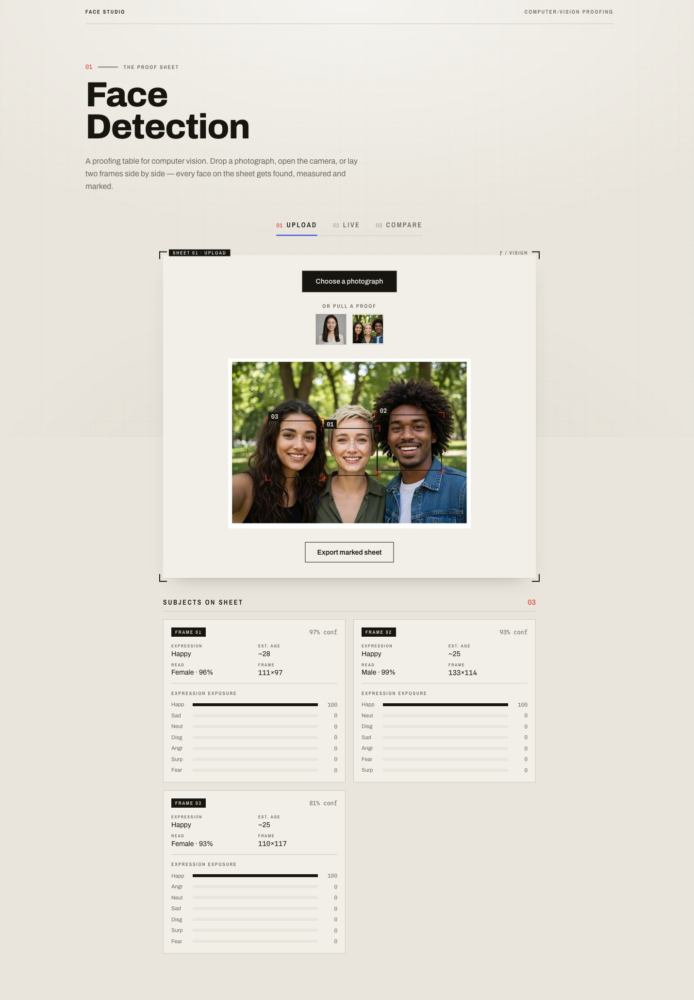
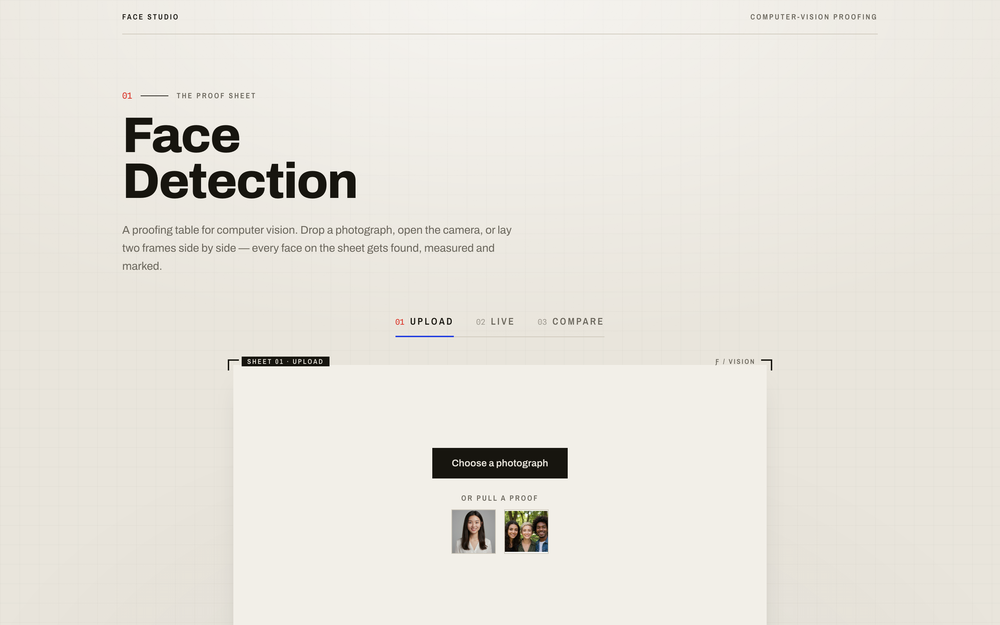

# Face Studio — In-Browser Computer-Vision Proofing


> A photographer's **proof sheet** for computer vision. Drop in a photograph, open your camera, or lay two frames side by side — every face gets **found, measured and marked** right in the browser. No uploads, no server, no API keys: the neural nets run entirely on your machine.

**🔗 [Live demo](https://face-detection-demo-zeta.vercel.app/)** &nbsp;·&nbsp; Runs 100% in the browser · Deployed on Vercel

Most face-detection demos ship your webcam frames off to a cloud API. This one doesn't send a single pixel anywhere — [face-api.js](https://github.com/justadudewhohacks/face-api.js) loads the models over the network once and then does all inference locally with TensorFlow.js. That makes it fast, private, and free to run.



## Screenshots

**Detection in action** — each face is boxed with printer's crop-marks, numbered, and landmark-mapped; the panel below reads out expression, estimated age, gender and detector confidence per subject:


**The proof sheet** — a warm, deliberately un-"AI" darkroom aesthetic (paper, ultramarine + grease-red, Archivo / Spline Mono) instead of the usual neon sci-fi HUD:



## Features

| Sheet | Mode | What it does |
|-------|------|--------------|
| 01 | **Upload** | Drag-and-drop or pick a photo (or pull a bundled sample). Detects every face, draws crop-marked frames + 68-point landmarks, and lets you **export the marked sheet** as a PNG. |
| 02 | **Live** | Runs detection on your webcam in real time, with an fps / ms-per-frame telemetry readout. |
| 03 | **Compare** | Lay two faces side by side and compute a face-similarity distance to judge whether they're the same person. |

For every detected face the app reports:
- **Bounding box** with printer's crop-tick corners and a frame number
- **68 facial landmarks** (eyes, brows, nose, jaw, mouth)
- **Dominant expression** + full expression distribution (happy / sad / angry / surprised / …)
- **Estimated age** and **gender** with probability
- **Detector confidence**

## How it works

```
         ┌─────────────────────────── browser ───────────────────────────┐
  image/ │  TinyFaceDetector ─► FaceLandmark68 ─► FaceExpression          │
  webcam │        │                                    │                  │  ►  crop-marked
  ─────► │        └─► AgeGender                         └─► FaceRecognition│     overlay + stats
         │  (all models fetched once from /models, then run via TF.js)    │
         └────────────────────────────────────────────────────────────────┘
```

1. On load, five [face-api.js](https://github.com/justadudewhohacks/face-api.js) models are fetched from the app's own `/models` folder (self-hosted — no third-party CDN).
2. Each frame (a still image, or a webcam frame in a `requestAnimationFrame` loop) is passed through the `TinyFaceDetector` at input size 512 / score threshold 0.5.
3. Landmarks, expressions, age/gender and a recognition descriptor are computed for every detection.
4. Results are drawn onto a `<canvas>` overlay aligned to the source image — the crop-mark frames, numbers and landmark dots — while the React UI renders the per-face stat cards.
5. For **Compare**, two 128-D face descriptors are reduced to a Euclidean distance; below the match threshold, it's the same person.

Everything after the initial model download happens offline in the tab. Turn off the network and it still works.

## Tech stack

**Vision** — [face-api.js](https://github.com/justadudewhohacks/face-api.js) (TinyFaceDetector · FaceLandmark68Net · FaceExpressionNet · AgeGenderNet · FaceRecognitionNet) on TensorFlow.js, models self-hosted under `public/models`
**Frontend** — React 19 + TypeScript · Vite · Tailwind CSS v4 (`@theme` design tokens) · Framer Motion (mode transitions, magnetic buttons)
**Tooling** — Oxlint · deployed on Vercel

## Running locally

```bash
npm install
npm run dev
```
The app runs at `http://localhost:5173`. No environment variables or API keys are needed — the models ship with the repo.

### Build
```bash
npm run build     # tsc -b && vite build
npm run preview   # serve the production build locally
```

## Project layout
```
public/models/         Self-hosted face-api.js model weights (fetched at runtime)
public/samples/        Bundled portrait / group proofs
src/hooks/
  useFaceDetection.ts  Model loading, detection loop, canvas overlay drawing, stats
src/components/
  Hero.tsx             Proof-sheet header
  ModeTabs.tsx         Upload / Live / Compare switcher
  DetectionCard.tsx    Framed "sheet" container
  StatsPanel.tsx       Per-face expression / age / gender / confidence readout
  FaceMatch.tsx        Two-face similarity comparison
  StudioBackdrop.tsx   Paper-grid backdrop
  CropFrame.tsx        Printer's crop-mark motif
src/index.css          Tailwind v4 @theme — the Proof Sheet palette + fonts
```

## Design notes
The brief was to look like a *tool a photographer or forensic analyst would actually use*, not a generic AI demo. So: a warm paper ground (`#E9E5DC`), ink black, an ultramarine accent (`#1F3BE0`) and grease-red crop ticks (`#DA2A1E`); Archivo for display, Archivo Narrow for spaced captions, Spline Sans Mono for all numerics. The printer's crop-mark is carried as a signature element from the page chrome straight into the detection overlay.

## Roadmap
- Multi-face recognition against a saved gallery
- Blur / redact faces on export (privacy mode)
- Batch-process a folder of images

---
*Built by [K Jayarama Das](https://github.com/jayaram-07). Runs entirely in your browser — no images ever leave the page.*
